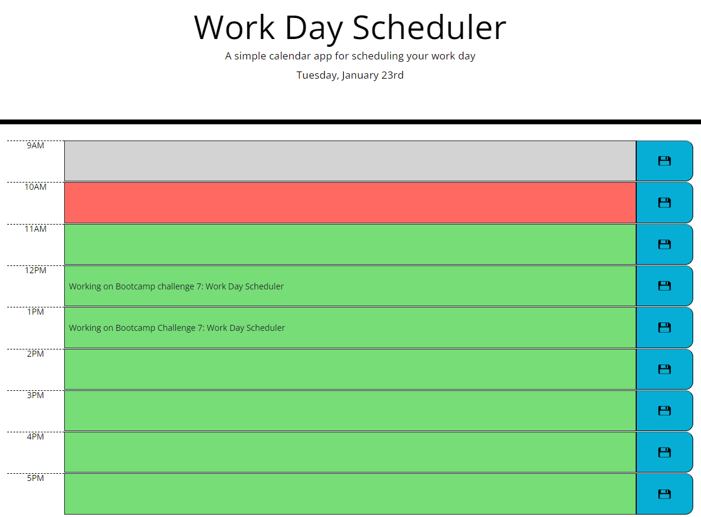

# Day-Task-Tracker

## Description

This project implements a user-friendly calendar application designed to operate within web browsers. Users can add/remove and save events for every working hour of the day.

Powered by a combination of DOM manipulation, advanced JavaScript, Web and JQuery APIs, as well as the Day.js library and Bootstrap, this application features a dynamically updated user interface, with HTML and CSS evolving in real-time.

Figure 1 shows a screenshot of the running application.

<figure>

<figcaption><em>Figure.1. Running Day Task Tracker</em></figcaption>
</figure>

 
When a user opens the scheduler, the current date is displayed at the top of the calendar. Each standard working hour (from 9 AM to 5 PM) is represented by a dedicated row, allowing users to add and save schedules for each time slot. The color-coded rows visually indicate whether a particular time slot is in the past (displayed in grey), present (in red), or future (in green), providing users with an intuitive way to manage their daily tasks.

## Installation

N/A

## Credits

The following resources were used.

* <https://www.w3schools.com/>
* <https://developer.mozilla.org/en-US/>
* <https://getbootstrap.com/>
* <https://api.jquery.com/>
* <https://day.js.org/>

## License

Please refer to the [License](./License) file.
